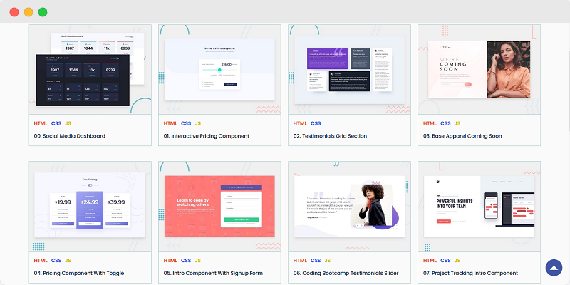
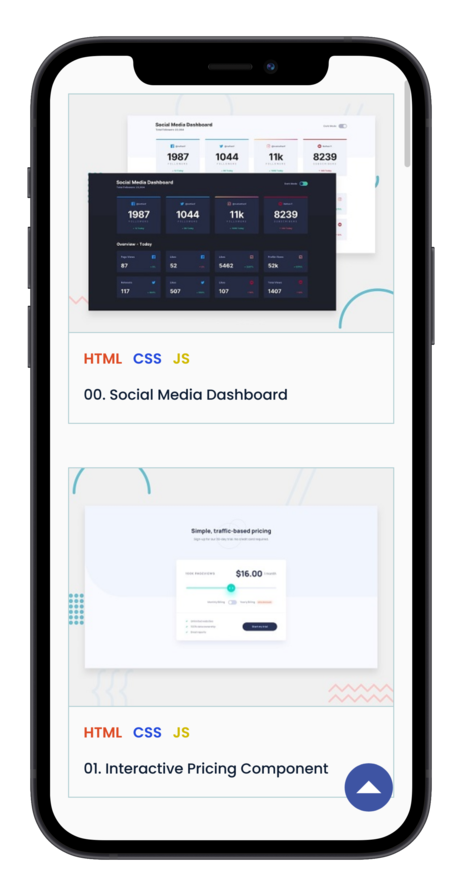
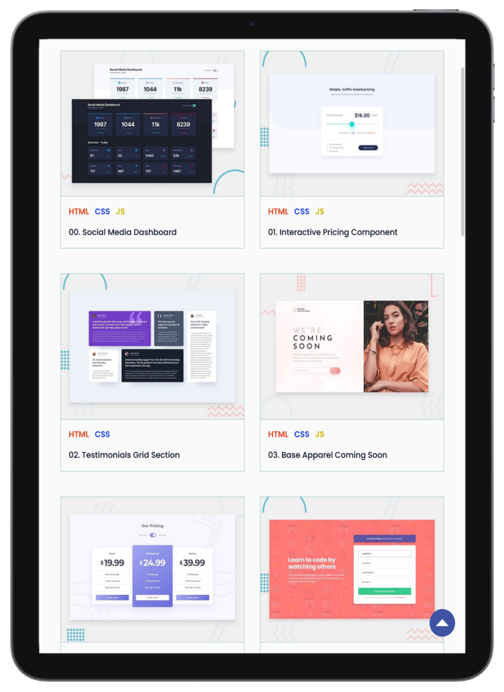

# Frontend Mentor - Web Components

<i>Desktop Preview</i>

## Description

This project is a collection of components and sections which are very much frequently used for building websites.

All components are built using the 3 fundamental technologies (**HTML**, **CSS**, and **Javascript**) used in Web Development, without the use of any external framework or library.

## Demo

<h2>
<a  href="https://ibrahimkundlik.github.io/WebComponents-FEM/">Live Site</a>
</h2>

All the components/sections present in this project are fully responsive on all devices including _DESKTOP_, _TABLET_, and _MOBILE_.

  
  

<i>Mobile & Tablet Preview</i>

## Built with

- Semantic **HTML5** markup
- **CSS** Custom Properties
- **CSS** Flexbox + **CSS** Grid
- Mobile-first workflow
- Vanilla **Javascript**

## Acknowledgments

Thank you to the entire Frontend Mentor team for providing such amazing frontend projects to work on.

UI Design credits - [Frontend Mentor](https://www.frontendmentor.io/challenges)
